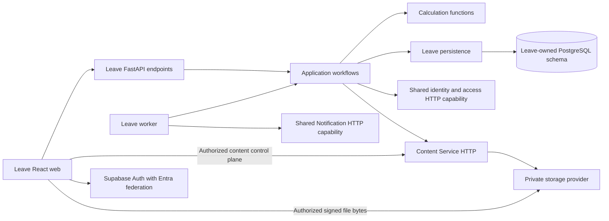

# Architecture Spine — Leave

## Design Paradigm

**Lightweight layered application silo.** FastAPI endpoints authenticate and adapt;
application workflows authorize, load inputs and own transactions; focused calculation
functions consume explicit inputs without database or HTTP access where practical.
Persistence helpers never commit independently. Avoid a generic policy/workflow engine.

This contract consolidates accepted decisions; it does not authorize implementation.
[Requirements](../features.md), [delivery gates](../implementation-plan.md), and approved
UX remain authoritative for product behavior. Accepted ADRs retain their authority and
supersession links; these AD identifiers provide a stable implementation map.
[The working log](../../../../_bmad-output/planning-artifacts/architecture/architecture-leave-2026-09-20/.memlog.md)
contains elicitation and rationale. Leave runtime and builder generation remain planned.

## Inherited Invariants

References below use **P** for the [platform ADR collection](../../../../platform/docs/architecture/decisions/README.md)
and **L** for the [Leave ADR collection](./decisions/README.md). Original ADR numbers are retained.

| Inherited decisions | Binding scope |
| --- | --- |
| P-0001–0007, P-0011 | FastAPI boundary, Supabase Auth/Entra, silos, shared content/notifications, proven scaffolding, application permissions |
| P-0009–0010 | BMAD delivery; ATDD outer loop and focused TDD inner loop |
| P-0012–0018 | Operation identities, revisions, database access, migration ownership, restricted runtime identities and transaction NGO scope |
| P-0019–0022 | Current authorization, safe releases, bounded in-flight authority and short transactions |
| P-0023–0029 | Safe diagnostics, recovery commands, attribution, workers, versioned events and notification retention |
| P-0030–0038 | Attachment association, errors, session/draft recovery, constraints, signed lifetimes and grouped monitoring |
| L-0001–0120 with recorded supersessions | Domain permissions, policy/workflow history, derived balances, protected reservations, UX and operational targets |

## Invariants & Rules

### AD-1 — Layer and service ownership [ADOPTED]

- **Binds:** All Leave components and shared integrations.
- **Prevents:** A second browser data path, cross-silo database access and shared domain implementations.
- **Rule:** Browser business data goes through Leave FastAPI; use HTTP contracts for shared runtime capabilities. Only authentication and explicitly approved realtime use the browser Supabase client; Content Service control-plane calls and signed file transfer are explicit content exceptions, preserving domain authorization. Leave owns requests, policies, schedules, employment settings, manually maintained supervisor assignments, approval routing, balance history and document associations. Shared identity supplies the person, never a second editable Leave directory. Platform packages supply build-time clients/UI/scaffolding, not imported service servers. Inherits P-0001–0006, P-0014.



### AD-2 — Verified authority and NGO isolation [ADOPTED]

- **Binds:** Endpoints, workers, reports, support commands and document access.
- **Prevents:** JWT role staleness, tenant switching through payloads and implicit administrative access.
- **Rule:** Verify current membership/permissions through shared access on each protected request, then apply Leave resource/action rules. Unavailable verification fails closed with a retryable response. Set verified NGO/actor context per transaction with fail-closed RLS and restricted owner-specific runtime roles; test actual roles and pool reuse. Short already-authorized execution may finish after revocation; new/delayed execution reauthorizes. Approver appointment grants bounded resource authority; document permission remains separate from sensitive type/note visibility. Inherits P-0011, P-0017–0019, P-0021, P-0026 and L-0006, L-0012–0017, L-0079, L-0082.

### AD-3 — Atomic, serialized domain commands [ADOPTED]

- **Binds:** Submission, approval, cancellation, adjustments, corrections and related writers.
- **Prevents:** Concurrent overspending, partial audit/outbox writes and database locks held during remote waits.
- **Rule:** Coordinate briefly per employee within NGO across leave types, before loading protected mutable state and through commit. Atomically commit command result, request/workflow effects, reservation/ledger effects, required decision evidence, audit and outbound intent. Every related writer participates. Protect shared policy/calendar/employment dependencies through commit as well; an employee lock alone is insufficient. External waits occur outside business locks by default; documented exceptions require bounded consistency/recovery behavior. Bound lock waits, preserve input and recalculate after acquisition. Inherits P-0012, P-0022 and L-0112–0113.

### AD-4 — Retry identity and reviewed-state protection [ADOPTED]

- **Binds:** Mutating APIs, frontend confirmations and receiver contracts.
- **Prevents:** Lost-response duplicates and stale approval masquerading as a new action.
- **Rule:** Generate one UUID operation ID per user action, retaining its original payload across retries; service actions use stable backend identities. Enforce atomic scoped duplicate protection; altered payload with the same identity conflicts. Resource ID, integer revision, operation ID, downstream event ID and trace ID have distinct purposes. Compare expected revisions atomically and revalidate related inputs; changed consequential results require renewed confirmation, including exact increased unpaid acknowledgement. Resolve uncertain outcomes before edited/new attempts; a known uncommitted busy result may be retried. Inherits P-0012–0013 and L-0032, L-0112–0113.

### AD-5 — Historical facts and derived entitlement [ADOPTED]

- **Binds:** Calculations, configuration, migration, corrections and history views.
- **Prevents:** Double-posted accrual, mutable balance truth and rewritten historical decisions.
- **Rule:** Compute automatic daily/upfront/monthly entitlement on demand from effective-dated rules and immutable actual events; no daily posting worker or authoritative stored current balance. Archive stable configuration identities without erasing versions. Preserve submitted policy/work-time evidence, effective versus recorded dates, and calculation-version snapshots for consequential decisions in a modest Leave-owned table. Corrections add evidence and recompute affected history while retaining original decisions. Use indexed direct calculation first; checkpoints require measured need and are rebuildable. Inherits L-0001 as qualified by L-0090, L-0002–0003, L-0086, L-0106–0108, L-0111.

### AD-6 — Deterministic time, precision and allocation [ADOPTED]

- **Binds:** Balance, availability, duration, policy changes and historical replay.
- **Prevents:** Different screens calculating different balances or reclaiming accrual excluded by caps.
- **Rule:** Canonical consumption is minutes; employee work timezone defines business dates. Use applicable effective versions and precise cumulative earning, flooring usable totals to whole minutes rather than rounding each day. Apply expiry/carry-over before new earning; evaluate caps before usability rounding and never catch up excluded accrual. Automatic start-of-day effects precede same-day user events ordered by server sequence assigned in the serialized mutation. Fund each leave date from valid eligible entitlement, earliest expiry first, protecting existing reservations. Cancellation replays cap consequences. Daily/monthly/upfront changes obey their distinct approved effective boundaries. Detailed formulas stay in L-0019–0048, L-0083, L-0089–0110 and requirements.

### AD-7 — One calculation authority and independent approval gates [ADOPTED]

- **Binds:** Preview, submission, approval, administrative changes and browser behavior.
- **Prevents:** Browser policy drift and approval success bypassing funding or coverage safeguards.
- **Rule:** Frontend validation/conversions provide immediate feedback; backend independently determines duration, entitlement and paid/unpaid consequences. Previews are provisional, refresh on relevant changes and ignore superseded responses; consequential commands reload and calculate current protected inputs. Approval routing is snapshotted domain configuration with appointment/absence rules, not separate final-approver roles. Finalization independently checks required decisions, approval coverage, employment/date constraints, documents and exact unpaid acknowledgement. Inherits L-0007–0008 with L-0078–0082, L-0032, L-0049, L-0074, L-0088, L-0112.

### AD-8 — Draft lifecycle and recoverable interaction [ADOPTED]

- **Binds:** Apply, autosave, NGO switching, session recovery and submission.
- **Prevents:** Multiple competing drafts, overwritten edits, phantom saved indicators and resurrection after closure.
- **Rule:** Atomically create-or-resume one employee application draft per employee/NGO without overwriting saved values; managers' on-behalf requests leave it untouched. Drafts reserve nothing. Serialize/coalesce same-tab saves; acknowledge only saved revisions. Other-tab revision conflicts pause autosave with recoverable local edits and explicit review. Check editability and revision together; old writes/create retries cannot reopen finalized/discarded drafts. Restore only authorized same-user context after sign-in; no automatic consequential confirmation. After confirmed submission return to My Leave with persistent status. Inherits P-0032–0034 and L-0067–0068, L-0075, L-0087–0088, L-0118.

### AD-9 — Recoverable content with domain authorization [ADOPTED]

- **Binds:** Uploads, attachment associations, read links and cleanup.
- **Prevents:** Upload success mistaken for attached evidence, post-verification byte replacement and orphan cleanup deleting referenced files.
- **Rule:** Content Service owns metadata, provider adapters, signed operations and retention; Leave owns document associations and domain permission. Signed transfer does not establish an association. Finalized content identity binds exact verified bytes, including across outstanding upload retries and verification/finalization races; replacement requires new content identity, verification and authorized audited association change under [P-0038](../../../../platform/docs/architecture/decisions/0038-finalized-content-byte-identity.md). Validate ownership/readiness and coordinate pending/confirmed association with cleanup; retries reuse content/operation identity. Required documents gate submission. Private read links default to five minutes and upload links to fifteen, with fresh authorization on renewal; expiration cannot recall downloaded bytes. Keep sensitive metadata behind its permission. Inherits P-0004–0005, P-0030, P-0036 and L-0006, L-0016–0017.

### AD-10 — Owned durable delivery, separate from domain success [ADOPTED]

- **Binds:** Leave outbox, worker and shared notification receiver.
- **Prevents:** Request-bound lost jobs, duplicate effects, ordering assumptions and notification failure undoing leave.
- **Rule:** Leave owns its PostgreSQL outbox and API/worker codebase/release; production API and initially one worker run as separate processes, potentially on one machine. Claims expire recoverably and stale holders cannot finalize. Restricted discovery precedes authoritative per-item NGO scope. Shared notification service accepts over HTTP with durable duplicate protection and owns channel delivery thereafter. Preserve event type/version, causal links and compatibility across retryable work. No MVP broker or workflow engine. Inherits P-0006, P-0024, P-0026–0028 and L-0114–0116.

### AD-11 — Delivery relevance, privacy and bounded recovery [ADOPTED]

- **Binds:** Notification production, handover, user messages and operational retry.
- **Prevents:** Old actions misrepresented as current, private content leaked and unbounded replay evidence.
- **Rule:** Leave may skip obsolete unhanded action intent with reason, preserving payload/audit; uncertain or accepted remote delivery is not cancelled by a local status. Notifications describe dated events and links open current authorized state; arrival order is not guaranteed. Email/in-app request data stays limited to name, dates, status and link. Original notification retry expires ninety days from creation; terminal outbox/attempt retention is ninety days after terminal state, receiver dedup at least ninety days from acceptance and while unresolved. Receiver rejects expired events even after cleanup. Older communication requires a new authorized event, not a repeated leave action. Inherits P-0029 and L-0014–0015, L-0116–0117.

### AD-12 — Shared contracts, constrained data and accessible presentation [ADOPTED]

- **Binds:** API schemas, persistence, shell/components, reports and localized UX.
- **Prevents:** ORM models becoming public APIs, inconsistent errors and parallel application UI conventions.
- **Rule:** Keep Pydantic API schemas separate from SQLAlchemy models; OpenAPI generates or validates frontend types. Use stable machine error identifiers, safe typed details and localized presentation, never parsed English. Enforce local structural/NGO constraints in DB alongside domain workflows, without unauthorized cross-owner foreign keys. Attribute mutable/immutable records by their category and retain consequential audit separately. Reuse shared shell/primitives and proven domain-neutral controls; Leave owns domain views and report authorization/query semantics. Use calm, spacious neutral surfaces and the approved accent/typography; desktop application drawers become full-page mobile flows. Meet WCAG 2.2 AA, English default and Portuguese readiness for Mozambique/Angola under approved UX. Inherits P-0014, P-0025, P-0031, P-0035 and L-0059–0061, L-0072–0073.

### AD-13 — Release, recovery and observability envelope [ADOPTED]

- **Binds:** API/worker deployment, migrations, operational tools and pilot readiness.
- **Prevents:** Startup migration races, premature success reports and telemetry leaking business content.
- **Rule:** Coordinate per-owner Alembic histories before activation; restricted runtime cannot migrate. Ordinary releases preserve previous-version compatibility; no automatic downgrade. Bound worker drain and recover after forced termination, retaining supervisor evidence. Separate API readiness, worker heartbeat/progress and provider delivery health; notification outages do not disable independent Leave actions. Use safe structured logs, operation/trace links and basic backend OpenTelemetry, with bounded asynchronous telemetry export. Support initiates versioned scoped commands remotely through deployment access; credentials stay remote and consequential recovery is audited. Inherits P-0015–0017, P-0020, P-0023–0027, P-0037.

## Consistency Conventions

| Concern | Contract |
| --- | --- |
| Identity | Shared stable person/service IDs; NGO membership is distinct from authentication; effective Leave employment/settings reference shared identity |
| Time | UTC recorded timestamps; employee-local business dates; explicit effective dates; server sequence resolves same-day ties |
| Sensitive data | No notes, medical metadata, payload dumps, credentials or signed URLs in diagnostics; authorized audit is separate |
| Dependency errors | Per-operation bounded attempt and retry; distinguish denied/missing/unavailable; no persistent frontend offline flag or health-preflight polling |
| Shared patterns | Prove in a working slice, then update applicable scaffold, UI, agent context, documentation and ADR references in the same delivery item |

## Stack and Structural Seed

Accepted stack choices are inherited, not new version commitments. Pin and verify compatible
versions before the first dependent story; no package lock or runtime compatibility claim
is made by this document.

| Area | Accepted seed |
| --- | --- |
| Web | TypeScript, React, Vite and owned shadcn-based platform UI |
| API/data | Python, FastAPI, separate Pydantic schemas, SQLAlchemy and Psycopg; no SQLModel default or business-data Supabase HTTP path |
| Database/migrations | Supabase PostgreSQL; per-owner schemas and Alembic revision/version-table ownership |
| Identity/content | Supabase Auth with Entra; shared Content Service with private Supabase Storage/Azure Blob adapters |
| Delivery/telemetry | PostgreSQL outbox, separate Python worker process, HTTP notification receiver, basic backend OpenTelemetry |

```text
apps/leave/
  backend/              API, workflows, calculations, persistence and worker entry point
  backend/migrations/   Leave Alembic history, including reviewed RLS/privileges
  web/                  Leave screens using shared UI and typed API contracts
  tools/                Versioned import/support commands
  docs/                 Product truth, delivery tracker and architecture decisions
services/               Independently owned identity/access, content and notification contracts
platform/               Proven build-time UI, clients, scaffolding and conventions
```

Deployment seed: one Leave release contains API and worker processes; shared capabilities
retain HTTP boundaries even if co-hosted. Hosting topology, nonproduction environments,
secret provisioning and concrete shared identity/access service placement remain gates below.
No generic support UI, offline synchronization or AI remediation is required for MVP.
[Technology evidence](../../../../_bmad-output/planning-artifacts/architecture/architecture-leave-2026-09-20/reviews/technology-evidence.md)
records repository and official-document checks; dependency pins remain a delivery gate.

## Operational Targets

| Concern | Accepted target/source |
| --- | --- |
| Recovery | L-0119: maximum one-hour loss; restore essential service within four hours of incident declaration; thirty-day backups |
| Restore evidence | Before pilot, quarterly and after major backup changes; verify DB, private files and required identity/config dependencies together |
| Restore side effects | Pause outbound processing until producer/receiver/provider replay evidence is reconciled; hold uncertainty |
| Critical signals | L-0120: API unavailable or worker heartbeat missing five minutes; notification overdue warning fifteen minutes/escalation one hour; recovery point older than one hour or confirmed integrity failure alerts immediately |
| Alert semantics | Retry does not reset overdue age; future scheduled work excluded; group incident/escalation and verify recovery; no implied staffed SLA |

## Capability → Architecture Map

| Requirements area | Owning components | Governing ADs |
| --- | --- | --- |
| Identity, NGO setup, employee settings and roles | Shared identity/access plus Leave workflows | AD-1–2, AD-12 |
| Policies, calendars, accrual, carry-over and history | Leave configuration, calculations and persistence | AD-3–7 |
| Apply, balances, drafts and employee history | Leave web/API, shared shell | AD-4–8, AD-12 |
| Approval, coverage and administrative corrections | Leave workflows and immutable evidence | AD-2–7 |
| Documents | Leave associations and Content Service | AD-2, AD-9 |
| Notifications, reminders and escalation | Leave scheduling/intent, worker and shared receiver | AD-10–11, AD-13 |
| Organization overview, reports and audit | Leave authorized queries with shared display/export patterns | AD-2, AD-5, AD-12 |
| Migration, release and support | Versioned owner tools and deployment operations | AD-3–5, AD-12–13 |

## Deferred and Delivery Gates

These gates permit architecture consolidation, not dependent implementation. The technical
lead owns cross-story consistency; named capability owners complete contracts before the
first affected story is ready. Track completion in the existing implementation plan.

| Deferred item | Owner and deadline | Required resolution |
| --- | --- | --- |
| Shared identity/access ownership and contract | Platform identity owner + Leave lead; before first draft-slice story readiness | Existing identity schema adoption, service placement, person/membership/permission identifiers, current authorization API, role management, allowed references and revocation execution bounds; no second directory |
| Dependency pins and environment topology | Technical lead + operations; before first dependent story | Verify live compatibility, lock dependencies, choose development/test/staging/production isolation, provider configuration and secret handling |
| Concrete persistence and concurrency | Leave technical lead; before affected mutation story | Tables/keys, employee guard, shared-configuration and cross-employee approval/coverage dependency protection, lock order/timeouts, event sequencing, indexes and snapshot schema; all alternate writers participate |
| API operation/error contracts | Platform API owner + Leave lead; before first draft-slice story | Request/result recovery, scoped deduplication lifetime, revision fields, compatibility with existing numeric-code template, generated clients and framework adapters |
| Content association protocol | Content owner + Leave lead; before attachment story | Pending/confirmed reference handshake, cleanup coordination, fixed verified byte/version binding through finalization and reads, capability authorization and provider-enforced lifetime proof (see constraint below); no cleanup race with saved/in-flight associations |
| Worker and notification wire contracts | Leave + notification owners; before delivery story | Restricted discovery/claim mechanism, heartbeat, lease/shutdown bounds, retry schedule, durable acknowledgement and receiver expiry/deduplication tests |
| Reminders and scheduled domain transitions | Leave lead; before approval-cover/reminder stories | Durable due-work discovery, missed-run recovery and reauthorization for scheduled return/escalation; no automatic accrual posting dependency |
| Reporting/export and import details | Leave + shared UI/tool owners; before respective stories | Proven shared mechanisms, scoped queries, import reconciliation and consultant evidence; email sign-off stays outside Leave setup UI |
| Performance/browser evidence | Product owner + technical lead; relevant story planning | Representative history/NGO workloads, measurable response targets and supported browsers; measure before introducing calculation checkpoints |
| Operational deployment evidence | Operations; before pilot | Choose monitoring backend/probes/routing and log retention, verify backup/provider capability, rehearsal and alerts, migration failures and worker recovery |
| Future orchestration and integrations | Product/architecture owners; on committed need | Broker/Temporal, Graph synchronization, browser telemetry, AI investigation/fix workflow and dedicated support UI remain outside MVP |

Provider constraint: the standard Supabase `createSignedUploadUrl` API documents a
two-hour upload capability, so it cannot simply be labelled as the fifteen-minute
target in P-0036. Before the attachment story is ready, the Content owner must verify a
supported adapter path enforcing that target; a frontend timeout is insufficient.
If the target cannot be met, obtain an explicit superseding decision before proceeding.
[Official upload API](https://supabase.com/docs/reference/javascript/file-buckets-createsigneduploadurl),
checked 23 September 2026. Concrete provider selection does not belong to the browser.

First delivery slice after Phase 1 readiness: sign in → select NGO → open/edit/autosave →
close/reopen draft, including multi-tab conflict, failed-save and session recovery coverage.
It proves shared access, persistence and UI contracts; it does not claim complete accrual or
approval behavior. Observe relevant acceptance failures before implementation, then focused
unit/integration tests and affected contract/browser suites; preserve requirement traceability.
