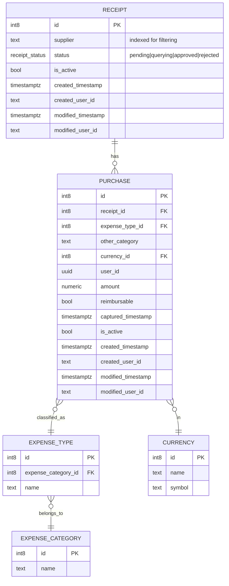
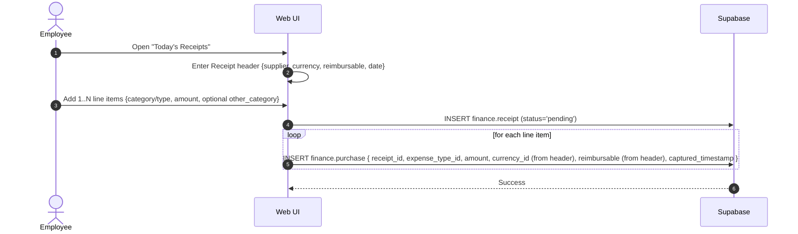
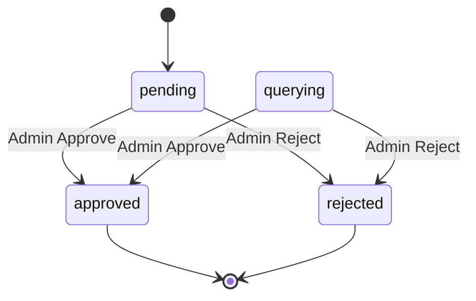
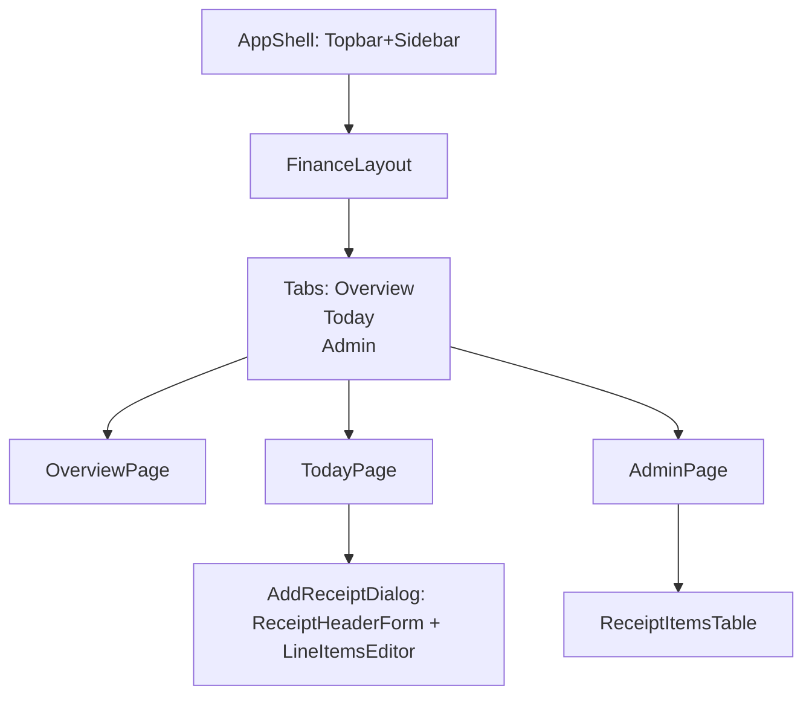

# Finance • Receipt Capturing — Functional Requirements Document

Version: 0.2 (Pending approval)
Owner: Finance Module
Scope: Frontend (React+Vite+ShadCN) + Supabase (direct; no custom backend)

## Overview
Employees log spend by creating a Receipt (header: supplier, currency, reimbursable, date, status) and adding one or more Purchase items (line items: expense category/type, amount, optional Other category when "Other" is chosen). Admin moderates status at the receipt level.

## Objectives
- Multi-item receipt capture with clear parent/child editing.
- Receipt moderation (pending/querying → approved/rejected) with default pending.
- Derived description "Category - Item" via deep select joins.
- Supplier captured as string on receipt, indexed for filtering.
- Standard audit columns auto-managed via centralized triggers.

## Entities & Relationships (finance schema) — Mermaid ER

## Key User Flows — Mermaid Sequence

## Status Lifecycle — Mermaid State

## UI Architecture — Mermaid Graph

## Data Contracts (Zod)
- Tables (finance.*): ReceiptTable (adds supplier + status), PurchaseTable, ExpenseType, ExpenseCategory, Currency.
- Deep row: PurchaseDeep = PurchaseTable + expense_type(expense_category) + currency.
- UI models: PurchaseSchema with derived description "Category - Item"; ReceiptWithAggregates includes supplier, totals, items.
- Role: employee display name from auth user metadata (client only).

## Queries
- Deep select example (PostgREST):
  - from finance.purchase select: id, amount, status, captured_timestamp, expense_type(id,name,expense_category(id,name)), currency(id,name,symbol)
  - Aggregate by receipt_id for lists; JOIN via receipt_id; supplier filter via ilike on finance.receipt.supplier (prefix when possible).
- Supplier suggestions: SELECT DISTINCT supplier FROM finance.receipt WHERE supplier IS NOT NULL ORDER BY supplier LIMIT 20

## Audit Policy (Centralized Functions & Triggers)
- actor_name() returns:
  coalesce(app.actor_override, jwt.user_metadata.name, jwt.email, current_user, 'system')
- set_audit_fields() BEFORE INSERT/UPDATE:
  - INSERT: created_user_id := coalesce(provided, actor_name()); modified_user_id := created_user_id; created_timestamp := coalesce(provided, now()); modified_timestamp := now()
  - UPDATE: modified_user_id := actor_name(); modified_timestamp := now()
- Trigger convention:
  create trigger trg_<schema>_<table>_audit before insert or update on <schema>.<table> execute function set_audit_fields()
- Bootstrap migration attaches triggers to all existing tables that have all 4 audit columns.

## Validation Rules
- Receipt must contain ≥ 1 line item.
- Amount > 0; if type == "Other", other_category required.
- Supplier is required; case-insensitive filtering supported.

## Admin Rules
- Approve/Reject per receipt; filter by supplier and status.

## Non-Goals
- No supplier table at this stage.
- No purchase.description column; description is UI-derived.

## Future Work
- Optional: separate profile table for richer display names; current display uses user metadata.
