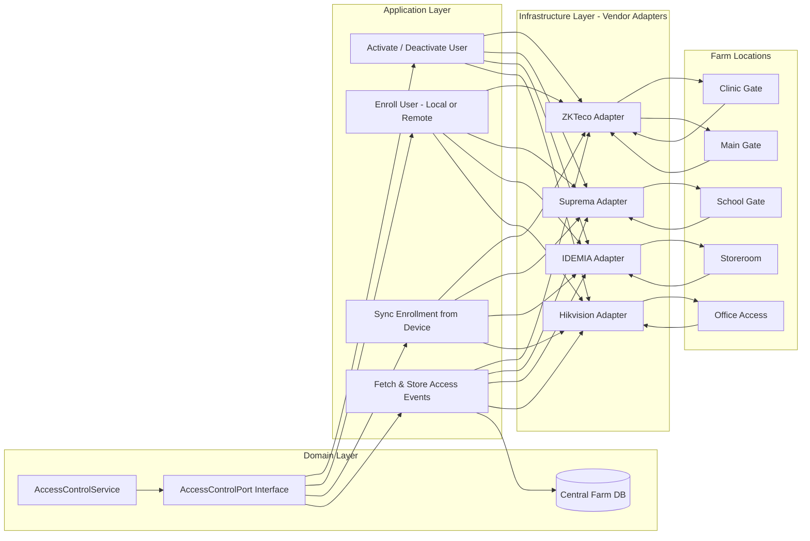
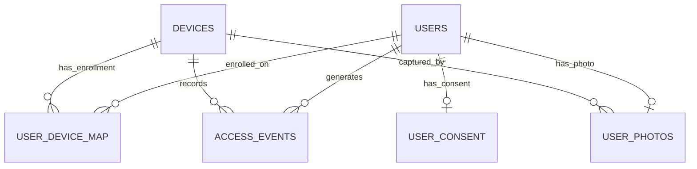
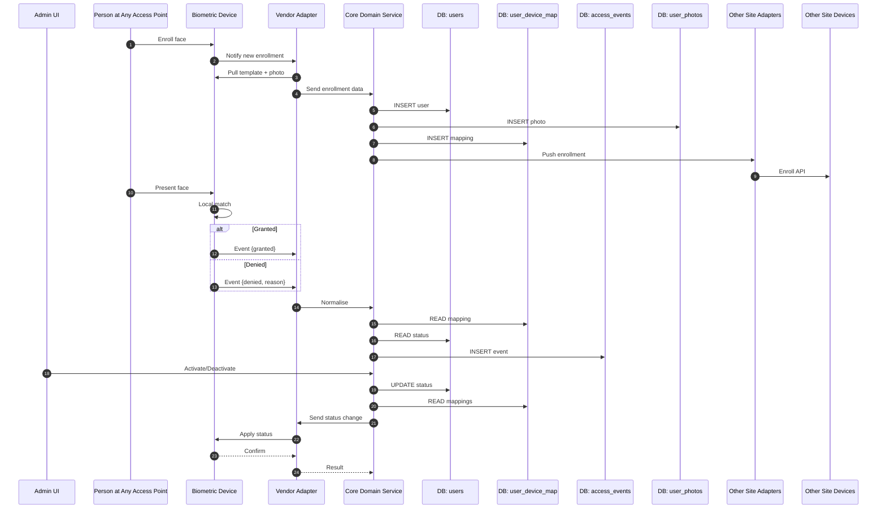
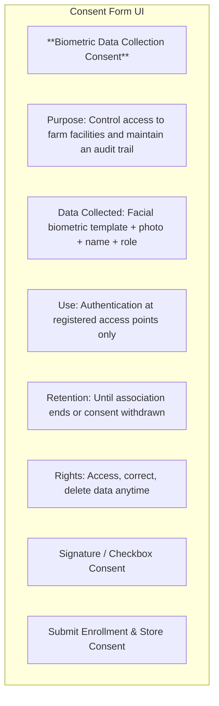
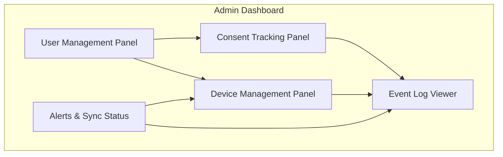

# 🚜 Farm Access Control – Implementation Blueprint

---

## 1. Overview

A **multi‑site, vendor‑agnostic, offline‑capable biometric access control system** for:

- Clinic
- School
- Storeroom
- Main Gate
- Office

**Core features:**

- Bias‑friendly **on‑device enrollment**
- Central logging of all granted/denied events
- Real‑time or delayed sync over PtMP/Starlink
- **Zambia Data Protection Act, 2021** compliance built in

---

## 2. Hexagonal + Multi‑Site Architecture



---

## 3. Database Schema

```sql
CREATE TABLE users (
    id UUID PRIMARY KEY,
    full_name TEXT NOT NULL,
    role TEXT NOT NULL,
    status TEXT NOT NULL DEFAULT 'active',
    created_at TIMESTAMPTZ DEFAULT now(),
    updated_at TIMESTAMPTZ DEFAULT now()
);

CREATE TABLE devices (
    id UUID PRIMARY KEY,
    name TEXT NOT NULL,
    location TEXT NOT NULL,
    vendor TEXT NOT NULL,
    model TEXT NOT NULL,
    ip_address INET,
    last_seen TIMESTAMPTZ,
    created_at TIMESTAMPTZ DEFAULT now()
);

CREATE TABLE user_device_map (
    user_id UUID REFERENCES users(id),
    device_id UUID REFERENCES devices(id),
    vendor_user_id TEXT NOT NULL,
    enrolled_at TIMESTAMPTZ DEFAULT now(),
    PRIMARY KEY(user_id, device_id)
);

CREATE TABLE access_events (
    id BIGSERIAL PRIMARY KEY,
    device_id UUID REFERENCES devices(id),
    user_id UUID REFERENCES users(id),
    event_time TIMESTAMPTZ NOT NULL,
    result TEXT NOT NULL,
    reason TEXT,
    match_score NUMERIC(5,2),
    raw_event JSONB,
    created_at TIMESTAMPTZ DEFAULT now()
);

CREATE TABLE user_photos (
    user_id UUID REFERENCES users(id) PRIMARY KEY,
    photo BYTEA NOT NULL,
    captured_at TIMESTAMPTZ DEFAULT now(),
    source_device_id UUID REFERENCES devices(id)
);

CREATE TABLE user_consent (
    user_id UUID REFERENCES users(id) PRIMARY KEY,
    consent_text TEXT NOT NULL,
    date_signed TIMESTAMPTZ NOT NULL,
    signature_hash TEXT NOT NULL,
    operator_id UUID,
    withdrawal_date TIMESTAMPTZ,
    withdrawal_reason TEXT
);
```

---

## 4. Entity–Relationship Diagram



---

## 5. Full User Lifecycle (Enrollment → Event Logging → Activation/Deactivation)



---

## 6. Compliance & Consent – Zambia Context

- **Explicit, informed consent** captured before enrollment.
- Version consent text & store in `user_consent`.
- Withdrawal triggers full de‑provisioning:
  - Remove templates from all devices.
  - Remove `user_device_map` entries.
  - Update `users.status`.

---

## 7. Consent Form UI (Enrollment)



**Consent Text Example:**
> I understand [Farm Name] will collect and store my facial biometric template, enrollment photo, and details for access control and audit logs. I have rights under the Zambia Data Protection Act, 2021, including access, correction, deletion, and consent withdrawal. I voluntarily consent until my association ends or I withdraw in writing.

---

## 8. Admin UI Dashboard (NEW Section)

**Key Panels:**
- **User Management** – Create/edit users, view enrollment status, activate/deactivate.
- **Device Management** – View device health, last sync, firmware, mappings.
- **Consent Tracking** – View consent status & history, trigger withdrawal workflows.
- **Event Log Viewer** – Filterable by site/device/date/result, export CSV/PDF.
- **Alerts & Sync Status** – Show offline devices, pending sync queues.



---

## 9. Quick Start Developer Checklist

**Phase 1:** Implement schema + domain interfaces  
**Phase 2:** Core use cases  
**Phase 3:** Event logging  
**Phase 4:** Multi‑site sync  
**Phase 5:** Consent capture + withdrawal  
**Phase 6:** Admin dashboard

---