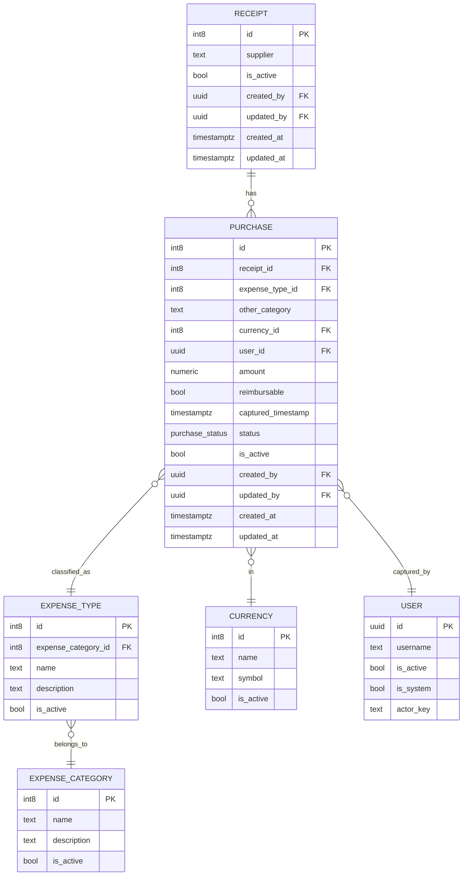

# Technical Specification — Digital Twin Platform (AgriPlatform)

**Version:** 1.0  
**Last Updated:** 2025-10-15  
**Owner:** Platform Architecture Team  
**Status:** Living Document

---

## Table of Contents

1. [Project Overview](#1-project-overview)
2. [Architecture](#2-architecture)
3. [Database Schema](#3-database-schema)
4. [Type Safety & Validation](#4-type-safety--validation)
5. [Frontend Patterns](#5-frontend-patterns)
6. [Backend Patterns](#6-backend-patterns)
7. [Development Workflow](#7-development-workflow)
8. [Code Conventions](#8-code-conventions)
9. [Security & Access Control](#9-security--access-control)
10. [Testing Strategy](#10-testing-strategy)
11. [Deployment & CI/CD](#11-deployment--cicd)
12. [Future Considerations](#12-future-considerations)

---

## 1. Project Overview

### 1.1 Platform Vision

AgriPlatform is a **Digital Twin Platform** designed for comprehensive farm management. The platform provides real-time operational visibility, financial tracking, logistics coordination, and human resource management through an integrated web-based interface.

### 1.2 Current Focus

**Primary Module:** Finance → Receipt Capturing  
**Status:** Active Development  
**Goal:** Enable employees to capture multi-item receipts with per-item moderation workflow

### 1.3 Technology Stack

| Layer | Technology | Version |
|-------|-----------|---------|
| **Frontend** | React | 19.1.1 |
| **Build Tool** | Vite | 7.1.2 |
| **Language** | TypeScript | 5.8.3 |
| **Styling** | Tailwind CSS | 4.1.12 |
| **UI Components** | ShadCN UI | Latest |
| **Forms** | React Hook Form | 7.62.0 |
| **Validation** | Zod | 4.0.17 |
| **Backend** | Supabase (PostgreSQL) | 2.55.0 |
| **Auth** | Supabase Auth | Built-in |
| **Storage** | Azure Blob Storage | Via Content Service |
| **Package Manager** | npm workspaces | - |

---

## 2. Architecture

### 2.1 Monorepo Structure

```
agriplatform/
├── .clinerules                    # AI workflow rules
├── package.json                   # Root workspace config
├── tsconfig.json                  # Root TypeScript config
├── docs/                          # Documentation
│   ├── tech-spec.md              # This document
│   ├── finance/                  # Domain-specific docs
│   └── hr/                       # HR documentation
├── memory_bank/                   # AI context persistence
│   ├── systemPatterns.md         # Architectural patterns
│   ├── progress.md               # Development progress
│   ├── techContext.md            # Technical context
│   └── activeContext.md          # Current work context
├── packages/
│   ├── frontend/                 # React + Vite application
│   │   ├── src/
│   │   │   ├── components/       # UI components
│   │   │   │   ├── layout/       # AppShell, Topbar, Sidebar
│   │   │   │   ├── ui/           # ShadCN UI components
│   │   │   │   └── finance/      # Finance domain components
│   │   │   ├── lib/              # Utilities
│   │   │   └── App.tsx           # Root component
│   │   └── package.json
│   ├── shared/                   # Shared schemas & types
│   │   └── schemas/
│   │       ├── zod/              # Zod schemas (TypeScript)
│   │       └── pydantic/         # Pydantic models (Python)
│   ├── backend/                  # Future: Custom backend services
│   └── tools/                    # Build & dev tools
├── supabase/                     # Supabase configuration
│   ├── config.toml               # Supabase CLI config
│   ├── migrations/               # Database migrations
│   ├── seed.sql                  # Production seed data
│   └── seed_dev.sql              # Development seed data
└── prompts/                      # AI planning prompts
```

### 2.2 Frontend Architecture

**Pattern:** Component-Based Architecture with Feature Modules

```
Frontend Architecture:
┌─────────────────────────────────────────────────────────┐
│ App.tsx (Root)                                          │
│  ├─ AppShell (Layout Container)                        │
│  │   ├─ Topbar (Brand, Search, User, RoleSwitcher)    │
│  │   ├─ Sidebar (Department Navigation)               │
│  │   └─ Content Area                                   │
│  │       └─ Department Layouts                         │
│  │           └─ Module Routes                          │
│  │               └─ Feature Pages                      │
│  └─ Providers (Auth, Theme, etc.)                      │
└─────────────────────────────────────────────────────────┘
```

**Component Organization:**
- **Shared Components** (`src/components/ui/`, `src/components/layout/`): Reusable across features
- **Feature Components** (`src/components/finance/receipt-capturing/`): Domain-specific, co-located with feature

### 2.3 Backend Architecture

**Current State:** Direct Supabase Access  
**Future State:** Hybrid (Supabase + Custom Services)

```
Backend Architecture (Current):
┌──────────────┐
│   Frontend   │
│  (React App) │
└──────┬───────┘
       │ @supabase/supabase-js
       ↓
┌──────────────────────────────────┐
│   Supabase Platform              │
│  ┌────────────┐  ┌─────────────┐│
│  │ PostgreSQL │  │ Supabase    ││
│  │  Database  │  │    Auth     ││
│  └────────────┘  └─────────────┘│
│  ┌────────────┐  ┌─────────────┐│
│  │  PostgREST │  │   Storage   ││
│  │    API     │  │   (Future)  ││
│  └────────────┘  └─────────────┘│
└──────────────────────────────────┘
```

**Future Backend Architecture:**
```
┌──────────────┐
│   Frontend   │
└──────┬───────┘
       │
       ├─────────────────┐
       │                 │
       ↓                 ↓
┌─────────────┐   ┌──────────────┐
│  Supabase   │   │   FastAPI    │
│  (Direct)   │   │   Services   │
│             │   │              │
│ • Auth      │   │ • Content    │
│ • CRUD      │   │ • Business   │
│ • RLS       │   │   Logic      │
└─────────────┘   └──────────────┘
```

### 2.4 Content System Architecture

**Pattern:** Hexagonal/Clean Architecture

The content system decouples media/file storage from business domains, providing a secure, flexible layer for all content operations.

```
Content System Flow:

Upload:
Frontend → POST /api/content/initiate 
        → Backend returns signed upload URL
        → Frontend uploads to Azure Blob
        → POST /api/content/{id}/finalize

Download:
Frontend → GET /api/receipts/{id}/content
        → Backend returns signed download URLs

Delete:
Frontend → DELETE /api/content/{id}
        → Backend removes from storage + database
```

**Database Schema (cs schema):**
- `cs.content_source`: Storage provider configurations (Azure Blob, future: S3)
- `cs.content_store`: Content metadata (external_key, mime_type, size, checksum)
- `cs.receipt_content`: Domain mapping (receipt_id → content_id with role)

**Benefits:**
- Domain separation: Finance doesn't know about Azure Blob details
- Security: All access controlled through backend with JWT validation
- Flexibility: Easy to switch storage providers or add CDN
- Auditability: All content operations logged through backend

---

## 3. Database Schema

### 3.1 Schema Organization

The database is organized into logical schemas:

| Schema | Purpose | Tables |
|--------|---------|--------|
| `public` | Default schema (minimal use) | - |
| `finance` | Financial operations | receipt, purchase, expense_category, expense_type, currency |
| `identity` | User management & RBAC | users, user_roles, role_permissions, audit_log |
| `cs` | Content system | content_source, content_store, receipt_content |
| `audit` | Audit logging (future) | - |

### 3.2 Core Entity Relationships



### 3.3 Audit Pattern

**Centralized Audit Functions:**

```sql
-- Returns current actor name
actor_name() → text
  Returns: coalesce(
    app.actor_override,
    jwt.user_metadata.name,
    jwt.email,
    current_user,
    'system'
  )

-- Sets audit fields automatically
set_audit_fields() → trigger
  INSERT:
    created_by := coalesce(provided, actor_name())
    updated_by := created_by
    created_at := coalesce(provided, now())
    updated_at := now()
  
  UPDATE:
    updated_by := actor_name()
    updated_at := now()
```

**Trigger Convention:**
```sql
CREATE TRIGGER trg_<schema>_<table>_audit
  BEFORE INSERT OR UPDATE ON <schema>.<table>
  FOR EACH ROW EXECUTE FUNCTION set_audit_fields();
```

**Standard Audit Columns:**
- `created_by` (uuid or varchar): User who created the record
- `updated_by` (uuid or varchar): User who last updated the record
- `created_at` (timestamptz): Creation timestamp
- `updated_at` (timestamptz): Last update timestamp

### 3.4 Row Level Security (RLS)

**Status:** Enabled on all tables  
**Implementation:** Per-table policies based on user roles

**Example Policy Pattern:**
```sql
-- Read access for all authenticated users
CREATE POLICY "Users can read active records"
  ON finance.receipt FOR SELECT
  USING (is_active = true AND auth.uid() IS NOT NULL);

-- Insert access for employees
CREATE POLICY "Employees can insert receipts"
  ON finance.receipt FOR INSERT
  WITH CHECK (auth.uid() = created_by);

-- Update access for admins
CREATE POLICY "Admins can update receipts"
  ON finance.receipt FOR UPDATE
  USING (
    EXISTS (
      SELECT 1 FROM identity.user_roles
      WHERE user_id = auth.uid()
      AND role = 'admin'
      AND is_active = true
    )
  );
```

### 3.5 Enums

**finance.purchase_status:**
- `pending` (default)
- `approved`
- `rejected`
- `querying`

**identity.app_role:**
- `admin`
- `financeadmin`
- `employee`

**identity.app_permission:**
- Format: `<schema>.<table>.<action>`
- Actions: `admin`, `read`, `insert`, `update`, `delete`
- Example: `finance.purchase.read`, `finance.receipt.admin`

---

## 4. Type Safety & Validation

### 4.1 Zod Schema Generation

**Source of Truth:** Supabase MCP (Model Context Protocol)

**Generation Process:**
1. Query Supabase MCP for live schema
2. Generate Zod schemas matching exact types, enums, nullability
3. Create Row/Insert/Update variants
4. Infer TypeScript types from Zod schemas

**Schema Location:** `packages/shared/schemas/zod/`

**Example Structure:**
```typescript
// packages/shared/schemas/zod/finance/receipt.schema.ts
import { z } from 'zod';

// Base schema matching database columns
export const ReceiptRowSchema = z.object({
  id: z.number(),
  supplier: z.string().nullable(),
  is_active: z.boolean().nullable().default(true),
  created_by: z.string().uuid().nullable(),
  updated_by: z.string().uuid().nullable(),
  created_at: z.string().datetime().nullable(),
  updated_at: z.string().datetime().nullable(),
});

// Insert schema (omit auto-generated fields)
export const ReceiptInsertSchema = ReceiptRowSchema.omit({
  id: true,
  created_at: true,
  updated_at: true,
});

// Update schema (all fields optional except id)
export const ReceiptUpdateSchema = ReceiptRowSchema.partial().required({
  id: true,
});

// Infer TypeScript types
export type ReceiptRow = z.infer<typeof ReceiptRowSchema>;
export type ReceiptInsert = z.infer<typeof ReceiptInsertSchema>;
export type ReceiptUpdate = z.infer<typeof ReceiptUpdateSchema>;
```

### 4.2 Dual-Schema Sync Pattern

**When using Supabase only (current):**
- Generate Zod schemas directly from Supabase MCP
- Use for form validation, API response parsing, component props

**When using separate TypeScript backend (future):**
- Keep Zod on both frontend and backend
- Share schema definitions through `packages/shared/`

**When using Python backend (FastAPI - future):**
- **Backend:** Use Pydantic models for request/response validation
- **Frontend:** Generate Zod schemas from OpenAPI spec
- **Sync:** Automated conversion as part of build/CI workflow

**Benefits:**
- Ensures frontend and backend speak the same language
- Changes in DB schema propagate: MCP → backend models → frontend schemas
- Prevents runtime errors from mismatched payloads

### 4.3 Validation Locations

| Location | Tool | Purpose |
|----------|------|---------|
| **Form Input** | Zod + React Hook Form | Client-side validation before submission |
| **API Request** | Zod (FE) / Pydantic (BE) | Validate outgoing requests |
| **API Response** | Zod | Parse and validate incoming data |
| **Database** | PostgreSQL constraints | Final validation layer |

---

## 5. Frontend Patterns

### 5.1 Component Architecture

**Principle:** Separation of Shared vs Feature-Local Components

```
src/components/
├── ui/                          # Shared: ShadCN UI components
│   ├── button.tsx
│   ├── card.tsx
│   ├── dialog.tsx
│   └── ...
├── layout/                      # Shared: Layout components
│   ├── AppShell.tsx            # Main layout container
│   ├── Topbar.tsx              # Top navigation bar
│   └── Sidebar.tsx             # Department navigation
└── finance/                     # Feature: Finance domain
    ├── FinanceLayout.tsx       # Finance-specific layout
    └── receipt-capturing/      # Feature: Receipt capturing
        ├── pages/              # Page components
        │   ├── OverviewPage.tsx
        │   ├── TodayPage.tsx
        │   └── AdminPage.tsx
        └── components/         # Feature-local components
            └── AddReceiptDialog.tsx
```

### 5.2 Layout System (AppShell Pattern)

**Canonical ASCII Layout:**
```
+------------------------------------------------------------------------------+
| Topbar: Brand | Search | User | RoleSwitcher                                 |
+---------------------------+--------------------------------------------------+
| Sidebar (Departments)     | Content Area                                     |
| - Dashboard               |  /<department>/<module>                          |
| - Finance                 |   ├─ Tabs: [Overview] [Today] [Admin (admin)]   |
|   └─ Receipt Capturing    |   │                                              |
| - Logistics               |   ├─ Overview: StatsGrid + RecentTable           |
| - HR                      |   ├─ Today: AddDialog + List                     |
| - Operations              |   └─ Admin: Filters + AdminTable                 |
+---------------------------+--------------------------------------------------+
```

**Route Map (React Router - Future):**
```
/                                    → <AppShell><Dashboard /></AppShell>
/finance                             → <AppShell><FinanceLayout /></AppShell>
/finance/receipt-capturing           → <FinanceLayout><ReceiptDashboard /></FinanceLayout>
/finance/receipt-capturing/overview  → Overview tab
/finance/receipt-capturing/today     → Today's Receipts tab
/finance/receipt-capturing/admin     → Admin Panel tab (admin only)
```

### 5.3 UI Component Library (ShadCN UI)

**Installation:** Components are installed individually via CLI

**Installed Components:**
- `button`, `card`, `dialog`, `dropdown-menu`, `input`, `label`, `badge`, `tabs`

**Usage Pattern:**
```typescript
import { Button } from '@/components/ui/button';
import { Card, CardHeader, CardTitle, CardContent } from '@/components/ui/card';

export function MyComponent() {
  return (
    <Card>
      <CardHeader>
        <CardTitle>Title</CardTitle>
      </CardHeader>
      <CardContent>
        <Button>Click me</Button>
      </CardContent>
    </Card>
  );
}
```

**Customization:** Components use Tailwind CSS and can be customized via `className` prop

### 5.4 State Management

**Current:** React useState/useContext  
**Future:** Consider Zustand or React Query for complex state

**Pattern:**
- **Local State:** useState for component-specific state
- **Shared State:** Context API for cross-component state (auth, theme)
- **Server State:** Direct Supabase queries (future: React Query)

### 5.5 Accessibility

**Requirements:**
- All interactive elements must have proper labels
- Use semantic HTML elements
- Implement keyboard navigation
- Ensure color contrast meets WCAG AA standards
- Add aria-attributes where needed

**Example:**
```typescript
<button
  aria-label="Add new receipt"
  onClick={handleAdd}
  className="..."
>
  <PlusIcon aria-hidden="true" />
  Add Receipt
</button>
```

### 5.6 Responsiveness

**Approach:** Mobile-first design with Tailwind CSS

**Breakpoints:**
- `sm`: 640px
- `md`: 768px
- `lg`: 1024px
- `xl`: 1280px
- `2xl`: 1536px

**Pattern:**
```typescript
<div className="grid grid-cols-1 md:grid-cols-2 lg:grid-cols-3 gap-4">
  {/* Responsive grid */}
</div>
```

---

## 6. Backend Patterns

### 6.1 Service Layer Architecture

**Principle:** Thin controllers, fat services

**Future Structure:**
```
packages/backend/
├── src/
│   ├── controllers/          # HTTP request handlers
│   │   └── receipt.controller.ts
│   ├── services/             # Business logic
│   │   └── receipt.service.ts
│   ├── repositories/         # Data access
│   │   └── receipt.repository.ts
│   └── lib/                  # Utilities
```

**Pattern:**
```typescript
// Controller: Handle HTTP, delegate to service
export async function createReceipt(req, res) {
  const validated = ReceiptInsertSchema.parse(req.body);
  const result = await receiptService.create(validated);
  return res.json(result);
}

// Service: Business logic
export const receiptService = {
  async create(data: ReceiptInsert) {
    // Validate business rules
    // Call repository
    // Return result
  }
};

// Repository: Data access
export const receiptRepository = {
  async insert(data: ReceiptInsert) {
    return supabase.from('receipt').insert(data);
  }
};
```

### 6.2 API Design

**Style:** REST for CRUD, RPC for complex operations

**REST Endpoints:**
```
GET    /api/receipts           # List receipts
GET    /api/receipts/:id       # Get receipt
POST   /api/receipts           # Create receipt
PUT    /api/receipts/:id       # Update receipt
DELETE /api/receipts/:id       # Delete receipt
```

**RPC Endpoints:**
```
POST   /api/receipts/:id/approve    # Approve receipt
POST   /api/receipts/:id/reject     # Reject receipt
POST   /api/content/initiate        # Initiate upload
POST   /api/content/:id/finalize    # Finalize upload
```

### 6.3 Error Handling

**Standard Error Payload:**
```typescript
{
  error: string,      // Human-readable message
  code?: number,      // Application error code
  details?: any       // Additional context
}
```

**HTTP Status Codes:**
- `200`: Success
- `201`: Created
- `400`: Bad Request (validation error)
- `401`: Unauthorized
- `403`: Forbidden
- `404`: Not Found
- `500`: Internal Server Error

### 6.4 Request/Response Validation

**Pattern:** Validate both incoming requests and outgoing responses

```typescript
// Request validation
const validated = ReceiptInsertSchema.parse(req.body);

// Response validation
const response = ReceiptRowSchema.parse(dbResult);
return res.json(response);
```

---

## 7. Development Workflow

### 7.1 Plan → Approve → Act Gates

**Workflow Modes:**

**PLAN MODE:**
1. Read `memory_bank/*` before output
2. Query Supabase MCP for live schema
3. For frontend: Use "Frontend Planning Prompt"
4. For backend: Use "Backend Planning Prompt"
5. Show ASCII layout diagram + route map FIRST (no code)
6. Include recommendations for `.clinerules` / memory_bank updates
7. **WAIT for explicit `APPROVE LAYOUT: yes` before writing code**

**ACT MODE:**
1. Implement **only** what was approved in PLAN
2. Use corresponding "Acting Prompt"
3. Chunk changes; stop after scaffolding for confirmation before deeper integrations
4. After completion, update `memory_bank/progress.md` with:
   - What was delivered
   - Any deviations from plan
   - Remaining TODOs

### 7.2 Model Routing

**Planning Tasks:**
- **Free, UI-strong:** `Gemini 2.5 Pro`
- **Deep/full-stack vision:** `GPT-5 Thinking`

**Acting Tasks:**
- **Frontend or backend:** `Claude Sonnet 4` for clean, maintainable code

**Budget:**
- **Planning:** `DeepSeek R1`
- **Acting:** `DeepSeek V3`

### 7.3 Confirmation Gates

**Gate 1:** Layout/API diagram approved (`APPROVE LAYOUT: yes`)  
**Gate 2:** Scaffolding approved before wiring DB or business logic  
**Gate 3:** Final review before merge

### 7.4 Memory Bank Usage

**Files:**
- `systemPatterns.md`: Architectural patterns, ASCII templates
- `progress.md`: Development progress, completed tasks, TODOs
- `techContext.md`: Technology stack summary
- `activeContext.md`: Current work context

**Update Frequency:**
- After each major milestone
- When patterns change
- When new conventions are established

---

## 8. Code Conventions

### 8.1 Naming Conventions

| Type | Convention | Example |
|------|-----------|---------|
| **Files** | kebab-case | `receipt-capturing.tsx` |
| **Components** | PascalCase | `ReceiptDialog` |
| **Services** | PascalCase | `ReceiptService` |
| **Functions** | camelCase | `createReceipt()` |
| **Variables** | camelCase | `receiptData` |
| **Constants** | UPPER_SNAKE_CASE | `MAX_UPLOAD_SIZE` |
| **Types/Interfaces** | PascalCase | `ReceiptRow` |
| **Enums** | PascalCase | `PurchaseStatus` |

### 8.2 Type Inference

**Prefer type inference from Zod schemas:**

```typescript
// ✅ Good: Infer from Zod
export type Receipt = z.infer<typeof ReceiptRowSchema>;

// ❌ Avoid: Manual type definitions that can drift
export interface Receipt {
  id: number;
  supplier: string;
  // ...
}
```

### 8.3 Commit Conventions

**Format:** Conventional Commits

```
<type>(<scope>): <subject>

<body>

<footer>
```

**Types:**
- `feat`: New feature
- `fix`: Bug fix
- `refactor`: Code refactoring
- `docs`: Documentation changes
- `chore`: Maintenance tasks
- `test`: Test additions/changes
- `style`: Code style changes (formatting)

**Examples:**
```
feat(finance): add receipt approval workflow

Implement per-item approval/rejection for purchases.
Admins can now approve or reject individual line items.

Closes #123

fix(ui): correct tab navigation state

The active tab wasn't persisting on page refresh.
Now using URL params to maintain tab state.

refactor(schemas): migrate to Zod v4

Updated all schemas to use Zod v4 API.
No breaking changes to exported types.
```

### 8.4 TypeScript Configuration

**Strict Mode:** Enabled

```json
{
  "compilerOptions": {
    "strict": true,
    "noImplicitAny": true,
    "strictNullChecks": true,
    "strictFunctionTypes": true,
    "noUnusedLocals": true,
    "noUnusedParameters": true
  }
}
```

**No `any` allowed** - Use `unknown` if type is truly unknown

---

## 9. Security & Access Control

### 9.1 Role-Based Access Control (RBAC)

**Roles:**

| Role | Description | Permissions |
|------|-------------|-------------|
| `admin` | System administrator | Full access to all resources |
| `financeadmin` | Finance department admin | Full access to finance module |
| `employee` | Regular employee | Limited access, can create receipts |

**Role Assignment:**
- Stored in `identity.user_roles` table
- Multiple roles per user supported
- Roles can be activated/deactivated via `is_active` flag

### 9.2 Permission System

**Format:** `<schema>.<table>.<action>`

**Actions:**
- `admin`: Full control
- `read`: View records
- `insert`: Create records
- `update`: Modify records
- `delete`: Remove records

**Permission Mapping:**
- Stored in `identity.role_permissions` table
- Checked via RLS policies
- Enforced at database level

### 9.3 Row Level Security (RLS)

**Implementation:**
- Enabled on all tables
- Policies based on `auth.uid()` and role checks
- Separate policies for SELECT, INSERT, UPDATE, DELETE

**Example Policy:**
```sql
CREATE POLICY "Employees can view their own receipts"
  ON finance.receipt FOR SELECT
  USING (
    created_by = auth.uid()
    OR EXISTS (
      SELECT 1 FROM identity.user_roles
      WHERE user_id = auth.uid()
      AND role IN ('admin', 'financeadmin')
      AND is_active = true
    )
  );
```

### 9.4 Content Access Security

**Principles:**
- Frontend never accesses storage directly
- All content operations go through backend
- Signed URLs with short expiration (15 minutes)
- JWT validation on all content endpoints
- Role-based access to content

**Flow:**
1. Frontend requests content access
2. Backend validates JWT and permissions
3. Backend generates signed URL
4. Frontend uses signed URL (time-limited)

---

## 10. Testing Strategy

### 10.1 Testing Pyramid

```
        /\
       /  \
      / E2E \
     /--------\
    /Integration\
   /--------------\
  /   Unit Tests   \
 /------------------\
```

**Distribution:**
- **Unit Tests:** 70% - Fast, isolated, test individual functions
- **Integration Tests:** 20% - Test component interactions
- **E2E Tests:** 10% - Test critical user flows

### 10.2 Unit Testing

**Framework:** Vitest (for Vite projects)

**Coverage Goals:**
- **Utilities:** 90%+
- **Services:** 80%+
- **Components:** 70%+

**Example:**
```typescript
import { describe, it, expect } from 'vitest';
import { ReceiptInsertSchema } from './receipt.schema';

describe('ReceiptInsertSchema', () => {
  it('should validate valid receipt data', () => {
    const data = {
      supplier: 'Test Supplier',
      is_active: true,
    };
    expect(() => ReceiptInsertSchema.parse(data)).not.toThrow();
  });

  it('should reject invalid data', () => {
    const data = { supplier: 123 }; // Wrong type
    expect(() => ReceiptInsertSchema.parse(data)).toThrow();
  });
});
```

### 10.3 Integration Testing

**Framework:** React Testing Library

**Focus:**
- Component interactions
- Form submissions
- API calls (mocked)

**Example:**
```typescript
import { render, screen, fireEvent } from '@testing-library/react';
import { AddReceiptDialog } from './AddReceiptDialog';

describe('AddReceiptDialog', () => {
  it('should submit form with valid data', async () => {
    const onSubmit = vi.fn();
    render(<AddReceiptDialog onSubmit={onSubmit} />);
    
    fireEvent.change(screen.getByLabelText('Supplier'), {
      target: { value: 'Test Supplier' }
    });
    
    fireEvent.click(screen.getByText('Submit'));
    
    await waitFor(() => {
      expect(onSubmit).toHaveBeenCalledWith({
        supplier: 'Test Supplier'
      });
    });
  });
});
```

### 10.4 E2E Testing

**Framework:** Playwright

**Critical Flows:**
- User login
- Receipt creation (full flow)
- Admin approval workflow
- Content upload/download

**Example:**
```typescript
import { test, expect } from '@playwright/test';

test('employee can create receipt', async ({ page }) => {
  await page.goto('/login');
  await page.fill('[name="email"]', 'employee@test.com');
  await page.fill('[name="password"]', 'password');
  await page.click('button[type="submit"]');
  
  await page.goto('/finance/receipt-capturing');
  await page.click('text=Add Receipt');
  
  await page.fill('[name="supplier"]', 'Test Supplier');
  await page.click('text=Save');
  
  await expect(page.locator('text=Receipt created')).toBeVisible();
});
```

### 10.5 Database Testing

**Approach:** Test migrations and RLS policies

**Tools:**
- Supabase CLI for local testing
- pgTAP for database unit tests

**Example:**
```sql
-- Test RLS policy
BEGIN;
SELECT plan(1);

SET ROLE employee;
SET request.jwt.claim.sub = 'user-uuid';

SELECT results_eq(
  'SELECT id FROM finance.receipt WHERE created_by = ''user-uuid''',
  ARRAY[1, 2, 3],
  'Employee can see their own receipts'
);

SELECT * FROM finish();
ROLLBACK;
```

---

## 11. Deployment & CI/CD

### 11.1 Build Process

**Frontend:**
```bash
# Development
npm run dev

# Production build
npm run build

# Preview production build
npm run preview
```

**Build Output:**
- `packages/frontend/dist/` - Static assets
- Optimized, minified, tree-shaken

### 11.2 Migration Strategy

**Process:**
1. Create migration file: `supabase/migrations/YYYYMMDDTHHMM_description.sql`
2. Test locally: `supabase db reset`
3. Review changes: `supabase db diff`
4. Apply to staging: `supabase db push --db-url <staging-url>`
5. Verify staging
6. Apply to production: `supabase db push --db-url <prod-url>`

**Naming Convention:**
```
YYYYMMDDTHHMM_description.sql

Example:
20250815T1200_init_schema.sql
20250817T1648_finance_additional_columns.sql
```

**Best Practices:**
- Always include rollback strategy
- Test migrations on copy of production data
- Use transactions where possible
- Document breaking changes

### 11.3 Environment Configuration

**Environments:**
- **Local:** Development on localhost
- **Staging:** Pre-production testing
- **Production:** Live system

**Environment Variables:**
```
VITE_SUPABASE_URL=https://xxx.supabase.co
VITE_SUPABASE_ANON_KEY=xxx
VITE_API_URL=https://api.example.com
```

**Configuration Files:**
- `.env.local` - Local development (gitignored)
- `.env.staging` - Staging environment
- `.env.production` - Production environment

### 11.4 CI/CD Pipeline (Future)

**Proposed Pipeline:**

```yaml
# .github/workflows/ci.yml
name: CI/CD

on: [push, pull_request]

jobs:
  test:
    runs-on: ubuntu-latest
    steps:
      - uses: actions/checkout@v3
      - uses: actions/setup-node@v3
      - run: npm ci
      - run: npm run lint
      - run: npm run test
      - run: npm run build

  deploy-staging:
    needs: test
    if: github.ref == 'refs/heads/develop'
    runs-on: ubuntu-latest
    steps:
      - run: npm run deploy:staging

  deploy-production:
    needs: test
    if: github.ref == 'refs/heads/main'
    runs-on: ubuntu-latest
    steps:
      - run: npm run deploy:production
```

---

## 12. Future Considerations

### 12.1 Planned Features

**Short Term (1-3 months):**
- [ ] Complete Receipt Capturing module
- [ ] Implement Content System (FastAPI)
- [ ] Add Supabase Auth integration
- [ ] Implement React Router for navigation
- [ ] Add real-time updates (Supabase Realtime)

**Medium Term (3-6 months):**
- [ ] Logistics module
- [ ] HR module (employee management)
- [ ] Operations module
- [ ] Dashboard with analytics
- [ ] Mobile app (React Native or PWA)

**Long Term (6-12 months):**
- [ ] Advanced reporting and analytics
- [ ] IoT device integration
- [ ] Machine learning for predictions
- [ ] Multi-farm support
- [ ] API for third-party integrations

### 12.2 Technical Debt

**Current Known Issues:**
- No React Router implementation (using tabs instead)
- Mock user authentication (needs Supabase Auth)
- No error boundary components
- Missing loading states
- No offline support
- Limited test coverage

**Prioritization:**
1. **High:** Authentication, routing, error handling
2. **Medium:** Loading states, test coverage
3. **Low:** Offline support, advanced optimizations

### 12.3 Scalability Considerations

**Database:**
- Implement database partitioning for large tables
- Add read replicas for reporting queries
- Optimize indexes based on query patterns
- Consider materialized views for complex aggregations

**Frontend:**
- Implement code splitting for faster initial load
- Add service worker for offline capabilities
- Use React Query for efficient data fetching
- Implement virtual scrolling for large lists

**Backend:**
- Horizontal scaling of FastAPI services
- Implement caching layer (Redis)
- Use message queue for async operations
- Add CDN for static assets

**Monitoring:**
- Application performance monitoring (APM)
- Error tracking (Sentry)
- User analytics
- Database query performance monitoring

### 12.4 Documentation Maintenance

**This Document:**
- Review quarterly
- Update after major architectural changes
- Keep version history
- Solicit feedback from team

**Related Documentation:**
- Keep FRDs updated with implementation
- Document API changes in OpenAPI spec
- Maintain migration changelog
- Update memory_bank files regularly

---

## Appendix A: Quick Reference

### Key Commands

```bash
# Development
npm run dev                    # Start dev server
npm run build                  # Build for production
npm run lint                   # Run linter
npm run test                   # Run tests

# Database
supabase start                 # Start local Supabase
supabase db reset              # Reset local database
supabase db push               # Push migrations
supabase gen types typescript  # Generate TypeScript types

# Schema Sync
npm run tools -- sync-schemas  # Sync Zod/Pydantic schemas
```

### Important Paths

```
docs/tech-spec.md                              # This document
.clinerules                                    # AI workflow rules
memory_bank/systemPatterns.md                  # Architectural patterns
packages/shared/schemas/zod/                   # Zod schemas
supabase/migrations/                           # Database migrations
packages/frontend/src/components/              # React components
```

### Key Contacts

- **Platform Architecture:** [Team Lead]
- **Frontend Development:** [Frontend Lead]
- **Backend Development:** [Backend Lead]
- **Database Administration:** [DBA]
- **DevOps:** [DevOps Lead]

---

## Document History

| Version | Date | Author | Changes |
|---------|------|--------|---------|
| 1.0 | 2025-10-15 | AI Assistant | Initial comprehensive technical specification |

---

**End of Technical Specification**
